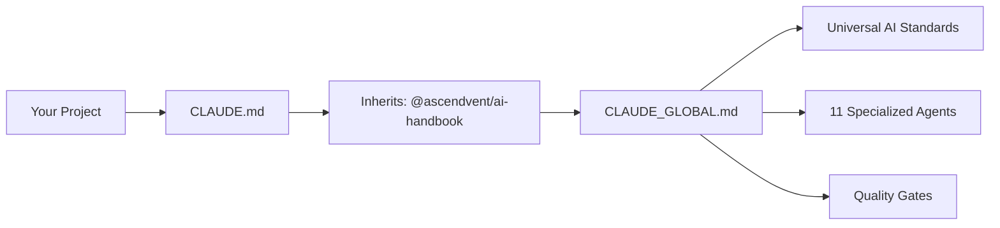

# Universal AI Engineering Handbook

**Open Source Standards for AI-Assisted Development**

A comprehensive, stack-agnostic policy framework that defines how Claude Code and AI agents should behave across development projects. This handbook provides engineering guardrails, testing protocols, and quality gates to ensure consistent, high-quality AI-assisted development.

[](https://opensource.org/licenses/Apache-2.0)
[](https://www.npmjs.com/package/@ascendvent/ai-handbook)
[](https://github.com/ascendvent/ai-handbook/actions)

---

## 🎯 What This Project Does

This handbook solves the problem of **inconsistent AI agent behavior** across development projects. When using Claude Code or other AI development tools, teams often struggle with:

- **Unpredictable AI responses** that vary between projects
- **Missing quality gates** that let buggy code through  
- **Inconsistent development practices** across team members
- **Lack of systematic approaches** when AI agents get stuck

**The Solution:** A universal inheritance system where projects declare `Inherits: @ascendvent/ai-handbook` in their `CLAUDE.md` file and automatically get:

✅ **Consistent AI Behavior** - All Claude Code agents follow the same quality standards  
✅ **Educational Communication** - AI explains concepts in simple, learning-friendly terms  
✅ **Systematic Blocker Handling** - Clear escalation criteria when AI gets stuck  
✅ **Quality Enforcement** - Mandatory testing, linting, and build validation  
✅ **Specialized Agent Library** - 11 purpose-built agents for different development tasks

---

## 🚀 Quick Start

### For Project Users

Add AI development standards to your project in 2 minutes:

```bash
# 1. Install the handbook
npm install --save-dev @ascendvent/ai-handbook

# 2. Copy the project template  
cp node_modules/@ascendvent/ai-handbook/templates/CLAUDE.template.md ./CLAUDE.md

# 3. Customize CLAUDE.md with your project details
# That's it! Your project now inherits universal AI standards
```

### What You Get

Once installed, Claude Code will automatically:
- Use educational, kid-friendly explanations for all technical concepts
- Follow systematic debugging approaches instead of random fixes
- Enforce quality gates (tests, linting, builds) before code changes
- Use specialized agents for different tasks (testing, development, GitHub workflows)
- Escalate properly when hitting authentication or environment blockers

---

## 🏗️ Project Architecture

### Core Components

| Component | Purpose |
|-----------|---------|
| **CLAUDE_GLOBAL.md** | Universal AI behavior rules (inherited automatically) |
| **agents/*** | 11 specialized agents for different development tasks |
| **templates/CLAUDE.template.md** | Clean template for project adoption |
| **package.json** | NPM package configuration for easy distribution |

### How Inheritance Works



Projects get universal standards while maintaining project-specific customization.

---

## Structure

| File / Directory                  | Purpose |
|-----------------------------------|---------|
| **POLICY.md**                     | Stack-agnostic global AI behavior rules |
| **CLAUDE_GLOBAL.md**              | Global master policy (inside this package) — never edited in projects |
| **agents/**                       | Automated enforcement agent configurations |
| **templates/CLAUDE.template.md**  | Template for creating a project-level `CLAUDE.md` that inherits global rules |

---

## How Projects Use This

### Key Files

**CLAUDE_GLOBAL.md**
* Located inside this handbook package
* Authoritative global AI policy
* Never modified in individual projects

**CLAUDE.md**
* Lives in your project root
* Inherits from `CLAUDE_GLOBAL.md` via `Inherits: @your-org/ai-handbook`
* Can override or extend policies for project-specific needs

---

## 📦 Installation & Usage

### For Project Teams

**1. Install the package**
```bash
npm install --save-dev @ascendvent/ai-handbook
```

**2. Set up your project configuration**
```bash
# Copy the clean template
cp node_modules/@ascendvent/ai-handbook/templates/CLAUDE.template.md ./CLAUDE.md

# Or download directly  
curl -o CLAUDE.md https://raw.githubusercontent.com/ascendvent/ai-handbook/main/templates/CLAUDE.template.md
```

**3. Customize for your project**
Edit `CLAUDE.md` with your specific tech stack, commands, and team information.

### Alternative: Direct Download
```bash
# Just get the template without installing the package
curl -o CLAUDE.md https://raw.githubusercontent.com/ascendvent/ai-handbook/main/templates/CLAUDE.template.md
```

### Verification
Your `CLAUDE.md` should start with:
```markdown  
Inherits: @ascendvent/ai-handbook
```
This tells Claude Code to apply universal AI development standards to your project.

---

## 🛠️ Development Setup

### For Contributors & Maintainers

**Prerequisites:**
- Node.js 16+ 
- npm 7+
- Git

**Local Development:**
```bash
# Clone the repository
git clone https://github.com/ascendvent/ai-handbook.git
cd ai-handbook

# Install dependencies  
npm install

# Run tests
npm test

# Validate all components
npm run validate

# Clean build artifacts
npm run clean:all
```

**Development Workflow:**
```bash
# Create feature branch
git checkout -b feature/my-improvement

# Make changes to agents/, templates/, or CLAUDE_GLOBAL.md

# Test your changes
npm test
npm run validate

# Commit and push
git add .
git commit -m "feat: add new agent for X"
git push origin feature/my-improvement

# Create pull request via GitHub
```

**Testing Locally:**
```bash
# Test the package in another project
cd ../test-project
npm install ../ai-handbook
cp node_modules/@ascendvent/ai-handbook/templates/CLAUDE.template.md ./CLAUDE.md

# Verify inheritance works with Claude Code
```

### Repository Structure
```
ai-handbook/
├── agents/                     # 11 specialized AI agents
│   ├── development-agent.md
│   ├── quality-agent.md
│   └── ...
├── templates/
│   └── CLAUDE.template.md      # Clean project template
├── docs/                       # Documentation
├── .github/                    # GitHub workflows & templates  
├── CLAUDE_GLOBAL.md           # Universal AI behavior rules
├── package.json               # NPM package config
└── README.md                  # This file
```

---

## Available Agents

All agents now include **Loop Detection & Research Escalation Protocol**:
- ⚠️  **Stop after 2 identical errors** - No infinite loops
- 🔬 **Research mode** - Investigate root cause using official docs
- 📋 **Present findings** - Show user research and proposed solution
- ✅ **User approval** - Wait for confirmation before implementing changes

**Development**
* `development-agent` — Full-stack React/Node.js/TypeScript implementation with loop detection
* `quality-agent` — Code quality analysis, refactoring, and review with framework change detection
* `test-agent` — Comprehensive testing with coverage enforcement

**Process Management**
* `sparc-agent` — SPARC methodology coordination with mandatory research phase for major changes
* `tracking-agent` — Planning and implementation alignment monitoring with process compliance enforcement
* `blocker-escalation-agent` — Systematic blocker and escalation decision making

**GitHub Integration**
* `github-workflow` — PR creation, branch management, and workflow automation
* `github-issues` — Issue management and project coordination

**Operations**
* `build-monitor` — Build validation, CI/CD operations, and health checks
* `security-ops` — Security monitoring, vulnerability scanning, and spend control
* `release-ops` — Release management, changelog generation, and deployment coordination

---

## Programmatic Usage

```javascript
const handbook = require('@ascendvent/ai-handbook');

// Get global policy
const globalPolicy = handbook.getClaudeGlobal();

// Validate CLAUDE.md inheritance
const config = fs.readFileSync('CLAUDE.md', 'utf8');
console.log(handbook.validatePolicy(config));

// Get agents
const agents = handbook.getAvailableAgents();
console.log(agents);

// Inherit agents manually
handbook.inheritAgents();
```

---

---

## Contributing

We welcome contributions! Please see our [Contributing Guidelines](CONTRIBUTING.md) for details.

### Development Setup
1. Fork the repository
2. Create a feature branch
3. Make your changes
4. Run tests: `npm test`
5. Submit a pull request

### Code of Conduct
This project follows the [Contributor Covenant](https://www.contributor-covenant.org/) Code of Conduct.

---

## License

Licensed under the Apache License, Version 2.0. See [LICENSE](LICENSE) for details.

**Copyright 2025 Ryan McDonald and Ascendvent LLC**

---

## Support

- 📖 [Documentation](https://github.com/ascendvent/ai-handbook)
- 🐛 [Report Issues](https://github.com/ascendvent/ai-handbook/issues)
- 💬 [Discussions](https://github.com/ascendvent/ai-handbook/discussions)