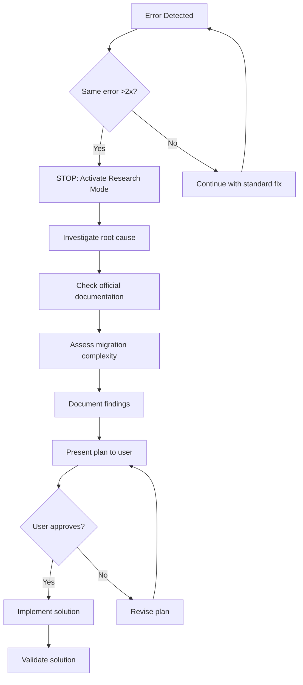

# Loop Detection & Research Escalation Protocol

## Overview

This document defines the mandatory loop detection and research escalation protocol that all agents must follow to prevent infinite loops and ensure proper investigation of framework changes or persistent errors.

## Background

The Express 5 migration incident revealed a critical process gap where agents repeatedly attempted the same fix without understanding the underlying issue (Express 4 to 5 breaking changes in routing syntax). This protocol prevents such loops and enforces research-first workflows for major changes.

## Protocol Definition

### 1. Loop Detection Triggers

Agents MUST stop and escalate when:
- **Same error occurs >2 times** with identical approach
- **Framework version conflicts** detected
- **Deprecated API warnings** appear repeatedly
- **Compilation failures** persist after multiple fix attempts
- **Test failures** repeat with same root cause

### 2. Research Escalation Workflow

When loop detection triggers:



### 3. Research Phase Requirements

All research phases MUST include:

#### Root Cause Analysis
- Investigate using official documentation
- Check changelogs for breaking changes  
- Identify framework compatibility issues
- Assess scope of impact across codebase

#### Documentation Requirements
Create research document: `docs/research/framework-migration-YYYY-MM-DD.md`

```markdown
# [Framework/Issue] Research Report

## Issue Identified
[Describe the root cause, not just symptoms]

## Impact Assessment  
- Affected files/components
- Migration complexity level (Low/Medium/High)
- Breaking changes identified
- Dependencies affected

## Proposed Solution
1. [Step-by-step migration plan]
2. [Testing strategy]
3. [Validation approach]

## Risks & Considerations
- [Potential issues]
- [Rollback strategy]
- [Timeline estimates]

## User Approval Required
This plan requires user review and approval before implementation.
```

#### Evidence Requirements
- Link to official documentation
- Specific error messages and their meaning
- Version compatibility matrices
- Migration guide references

### 4. Implementation Standards

#### For development-agent
```typescript
// BEFORE (causes loops)
while (error) {
  attemptSameFix(); // Infinite loop potential
}

// AFTER (with loop detection)  
let attempts = 0;
while (error && attempts < 2) {
  attemptFix();
  attempts++;
}
if (error && attempts >= 2) {
  escalateToResearch(error, context);
}
```

#### For quality-agent
- Monitor for repeated error patterns in analysis
- Flag framework version conflicts immediately
- Never attempt same refactor approach >2 times

#### For sparc-agent
- Mandatory research phase for any framework changes
- No progression to implementation without user approval
- Document research findings in Phase 0

#### For tracking-agent
- Monitor agent compliance with loop detection
- Flag process violations when research skipped
- Ensure documentation of all escalations

### 5. Success Criteria

#### Process Compliance
- [ ] Zero infinite loops in agent behavior
- [ ] All framework changes trigger research phase
- [ ] User approval obtained before major implementations
- [ ] Research documentation created for all escalations

#### Quality Metrics
- [ ] Error resolution time improved (research upfront vs. repeated failures)
- [ ] User confidence increased (transparent investigation process)
- [ ] Technical debt reduced (proper solutions vs. quick fixes)

### 6. Testing & Validation

#### Automated Tests
Run test suite: `tests/loop-detection-workflow.test.sh`

Tests validate:
- Loop detection triggers after 3 identical errors
- Framework change detection in package.json
- Research phase enforcement
- Proper escalation workflow
- Process compliance monitoring

#### Manual Validation
1. Simulate repeated error scenario
2. Verify agent stops after 2 attempts
3. Confirm research mode activation
4. Validate user approval requirement
5. Test implementation only after approval

### 7. Integration Points

#### Agent Coordination
- `quality-agent` detects framework issues → triggers research
- `development-agent` implements solutions → only after approval
- `sparc-agent` enforces methodology → includes mandatory research phase
- `tracking-agent` monitors compliance → flags violations

#### Workflow Integration
- Git hooks validate research documentation exists
- CI/CD checks ensure no framework changes without research
- PR templates require research document links for major changes

### 8. Emergency Procedures

#### Critical Production Issues
Loop detection may be bypassed ONLY when:
- Production system is down
- User explicitly authorizes emergency fix
- Research documentation created post-incident

Emergency bypass requires:
```bash
EMERGENCY_BYPASS=true REASON="Production down" agent-command
```

### 9. Continuous Improvement

#### Metrics Collection
- Number of loops prevented per month
- Time saved vs. repeated failure attempts
- User satisfaction with research quality
- Framework migration success rate

#### Process Refinement
- Monthly review of escalation triggers
- Agent behavior analysis and optimization
- Research documentation quality assessment
- User feedback integration

---

## Implementation Timeline

- ✅ **Phase 1**: Agent updates with loop detection (Completed)
- ✅ **Phase 2**: Research escalation workflows (Completed)
- ✅ **Phase 3**: Test suite creation (Completed)  
- ⏳ **Phase 4**: Documentation updates (In Progress)
- 📋 **Phase 5**: Team training and rollout

---

This protocol ensures systematic, research-first approaches to complex technical issues while preventing the infinite loops that plagued earlier agent implementations.